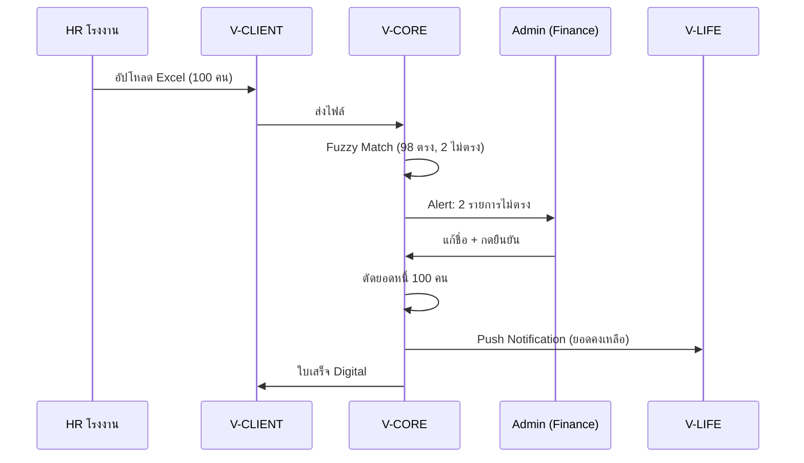
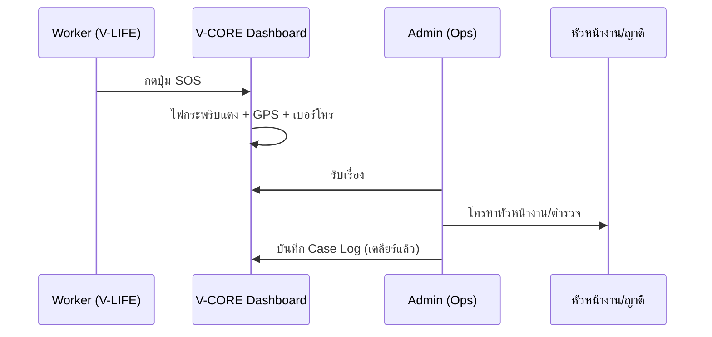

# PROJECT BLUEPRINT: V-CORE (Central Enterprise Resource Planning)

> **Version:** 1.0.0  
> **Last Updated:** 2026-01-06  
> **System Role:** ศูนย์กลางข้อมูลและการบริหารจัดการเบ็ดเสร็จ (Super Admin Control Panel)  
> **Platform:** Web-based Application (Responsive for Desktop & Tablet)

---

## สารบัญ (Table of Contents)

1. [ภาพรวมโครงการ (Project Overview)](#1-ภาพรวมโครงการ)
2. [Dashboard & Navigation](#2-dashboard--navigation)
3. [Operation Hub](#3-operation-hub)
4. [Partner Network](#4-partner-network)
5. [Client & Sales](#5-client--sales)
6. [Financial Center](#6-financial-center)
7. [V-Care & Academy](#7-v-care--academy)
8. [System Admin & Security](#8-system-admin--security)
9. [Scenario ตัวอย่างการใช้งาน](#9-scenario-ตัวอย่างการใช้งาน)
10. [Technical Notes](#10-technical-notes)

---

## 1. ภาพรวมโครงการ

### 1.1 วิสัยทัศน์ (Vision)
V-CORE เป็นระบบ ERP สำหรับ **V-GROUP** บริษัทจัดหาแรงงานจากลาวไปไทย โดยเป็นศูนย์กลางควบคุม:
- **V-LIFE** - แอปสำหรับแรงงาน (Workers)
- **V-PARTNER** - แอปสำหรับตัวแทน/นายหน้า (Agents) 148 สาขา
- **V-CLIENT** - แอปสำหรับนายจ้าง/โรงงาน (Employers)

### 1.2 กลุ่มผู้ใช้งาน (User Personas)

| Role | Description | Access Level |
|------|-------------|--------------|
| **Super Admin** | ผู้ดูแลระบบสูงสุด | Full Access |
| **Manager** | ผู้จัดการ | View All + Approve |
| **Operation Staff** | พนักงานปฏิบัติการ | Worker/Agent Data Only |
| **Finance** | ฝ่ายการเงิน | Financial Data Only |
| **Viewer** | นักลงทุน/ผู้ตรวจสอบ | Read-only Dashboard |

---

## 2. Dashboard & Navigation

### 2.1 Global Navigation (เมนูหลักด้านซ้าย)

```
📊 Dashboard (ภาพรวมสถานการณ์)
├── Cockpit Overview
├── Real-time Metrics
└── Action Required

⚙️ Operation Hub (จัดการแรงงาน - V-LIFE)
├── Pipeline Management (Kanban)
├── Worker Directory
├── Document Center
└── Academy Tracker

🤝 Partner Network (จัดการเครือข่าย - V-PARTNER)
├── Agent Database
├── Commission Management
├── Incentive Config
└── Material Distribution

🏭 Client & Sales (นายจ้าง - V-CLIENT)
├── Factory/Employer Profile
├── Order Management
├── Quotation Builder
└── Payroll Reconciliation

💰 Financial Center
├── Loan Portfolio
├── Corporate Accounting
├── Remittance Hub
└── Reports (P&L, Aging)

🎓 V-Care & Academy
├── Class Schedule
├── Assessment & Scoring
├── V-Care Matching
└── Guarantee Tracker

📈 Reports & Analytics
├── Business Intelligence
├── Export Center
└── Custom Reports

⚙️ System Config
├── User Management (RBAC)
├── Audit Logs
├── Notification Center
├── Localization Manager
└── System Monitor
```

### 2.2 Cockpit Dashboard (หน้าจอสรุปผล)

#### Zone A: Real-time Metrics
| Metric | Description |
|--------|-------------|
| Total Workers | จำนวนแรงงานทั้งหมด (Active/Inactive) |
| Pipeline Status | รอเอกสาร → รอส่งตัว → ทำงานแล้ว |
| Financial Health | ยอดหนี้คงค้าง, ยอดเก็บได้, NPL Rate |
| Today's Activity | สมัครใหม่วันนี้, ส่งถึงโรงงานวันนี้ |

#### Zone B: Action Required (งานด่วน)
- 🔴 **Urgent:** วีซ่าหมดอายุใน 30 วัน
- 🟡 **Alert:** โรงงานยังไม่ส่งไฟล์ตัดเงินเดือน
- 🟢 **Approval:** รออนุมัติค่าคอมมิชชั่น
- 🆘 **SOS Alert:** การแจ้งเตือนฉุกเฉินจาก V-LIFE

#### Zone C: Map Visualization
- แผนที่ลาว-ไทย แสดง Heatmap แหล่งที่มาแรงงาน
- ตำแหน่งรถบัส (Fleet Tracking)

#### Zone D: Global Search
- ค้นหาด้วย: ชื่อ, เบอร์โทร, เลขพาสปอร์ต, รหัสโรงงาน
- ผลลัพธ์พาไปหน้า Profile ทันที

---

## 3. Operation Hub

### 3.1 Pipeline Management (Kanban Board)

```
┌─────────────┬─────────────┬─────────────┬─────────────┬─────────────┬─────────────┐
│  NEW LEAD   │  SCREENING  │  DOCUMENTS  │   ACADEMY   │    READY    │  DEPLOYED   │
│ รายชื่อดิบ   │ รอตรวจโรค   │ ยื่นเอกสาร   │ เข้าค่ายฝึก  │ พร้อมส่งตัว  │ ส่งแล้ว     │
├─────────────┼─────────────┼─────────────┼─────────────┼─────────────┼─────────────┤
│   [Card]    │   [Card]    │   [Card]    │   [Card]    │   [Card]    │   [Card]    │
│   [Card]    │   [Card]    │   [Card]    │             │   [Card]    │   [Card]    │
│   [Card]    │             │             │             │             │   [Card]    │
└─────────────┴─────────────┴─────────────┴─────────────┴─────────────┴─────────────┘
```

**Actions:**
- Drag & Drop เพื่อเลื่อนสถานะ
- Click Card → Update Status / Reject พร้อมเหตุผล

### 3.2 Worker 360° Profile

| Tab | Content |
|-----|---------|
| **Personal Info** | รูปถ่าย, บัตร ปชช., ที่อยู่, เบอร์โทร, ญาติฉุกเฉิน |
| **Digital Documents** | Passport, Visa, Work Permit (Version Control) |
| **Employment History** | Timeline การทำงาน, คะแนนความประพฤติ |
| **Financial & Loan** | ยอดหนี้, ตารางผ่อน, Transaction Logs |
| **V-LIFE Simulation** | ปุ่ม "View as User" - เห็นหน้าจอเหมือนคนงาน |

---

## 4. Partner Network

### 4.1 Agent Database
- รายชื่อ Partner แยกตาม แขวง/เมือง
- Performance Metrics:
  - Recruitment Count (ยอดส่งคน)
  - Pass Rate (คุณภาพคน)
  - Dropout Rate (ยอดคนหนีงาน)

**Actions:**
- Approve/Ban Agent
- Issue Material (บันทึกการแจกป้าย/เสื้อ)

### 4.2 Commission Management
1. **Pending Approval** - รายการรอนุมัติ (คำนวณอัตโนมัติเมื่อครบเงื่อนไข)
2. **Disbursement** - สถานะการโอนเงิน (API หรือ Manual)
3. **Incentive Config** - ตั้งค่าโครงสร้างค่าคอมฯ (Tier 1, 2, 3)

---

## 5. Client & Sales

### 5.1 Factory/Employer Profile
| Field | Description |
|-------|-------------|
| Company Info | ชื่อ, ที่ตั้ง, เลขนิติบุคคล, HR Contact |
| Credit Limit | วงเงินเครดิต |
| MOU Quota | โควต้า Used/Remaining |
| Current Workforce | รายชื่อคนงานที่ทำงานอยู่ |

### 5.2 Order Management
1. **New Request** - คำสั่งจ้างจาก V-CLIENT
2. **Quotation** - สร้างใบเสนอราคา → ส่งอนุมัติ
3. **Deployment Plan** - จัดตารางส่งคน

### 5.3 Payroll Deduction Helper
```
[Import Excel] → [Auto-Matching] → [Discrepancy Report] → [Confirm Deduction]
```
- **Fuzzy Matching:** ใช้ Levenshtein distance เปรียบเทียบชื่อ (>80% = แนะนำ)
- **Partial Payment Logic:** ตัดดอกเบี้ยก่อน → เงินต้น → ยกยอดค้างชำระ

---

## 6. Financial Center

### 6.1 Loan Portfolio
| Report | Description |
|--------|-------------|
| Overview | ยอดปล่อยกู้, ยอดรับชำระ, กำไรดอกเบี้ย |
| Aging Report | ปกติ / ค้าง 1 เดือน / ค้าง >3 เดือน |
| Write-off | ตัดหนี้สูญ (ต้อง Supervisor อนุมัติ) |

### 6.2 Corporate Accounting
- **Expenses:** ค่าพาสปอร์ต, วีซ่า, รถ, เงินเดือน
- **Revenue:** ค่าหัวคิว, ส่วนต่างดอกเบี้ย
- **P&L:** งบกำไรขาดทุน Real-time (แยกตามสาขา/โรงงาน)

### 6.3 Remittance Hub
- **Transaction Queue:** รายการโอนเงินจาก V-LIFE
- **Processing:**
  - Auto: API ธนาคาร (BCEL/Kasikorn)
  - Manual: โอนเอง + แนบสลิป
- **FX Rate Setting:** อัตราแลกเปลี่ยนประจำวัน (Spread)

---

## 7. V-Care & Academy

### 7.1 Academy Management
| Feature | Description |
|---------|-------------|
| Class Schedule | ตารางอบรม (รุ่นที่ xx, วันที่ xx-xx) |
| Attendance | เช็คชื่อ (สแกนนิ้ว/QR Code) |
| Assessment | คะแนนสอบ (ภาษาไทย, ความสะอาด, มารยาท) |
| Inventory | เบิกจ่ายชุดฟอร์ม, อุปกรณ์, อาหาร |

### 7.2 V-Care Matching
- **Filtering:** ค้นหาแม่บ้านจากทักษะ
- **Booking:** จองคิวสัมภาษณ์ (Zoom/เจอตัวจริง)
- **Guarantee Tracker:** ติดตามระยะประกัน (3 เดือน)

---

## 8. System Admin & Security

### 8.1 Role-Based Access Control (RBAC)

| Role | Workers | Finance | Delete | System |
|------|---------|---------|--------|--------|
| Super Admin | ✅ | ✅ | ✅ | ✅ |
| Manager | ✅ | ✅ View | ❌ | ❌ |
| Operation | ✅ | ❌ | ❌ | ❌ |
| Finance | ❌ | ✅ | ❌ | ❌ |
| Viewer | 👁️ | 👁️ | ❌ | ❌ |

### 8.2 Audit Logs
- บันทึกทุก Action ในระบบ
- Example: `User: Somchai (Finance) แก้ไขยอดหนี้ Worker ID: 1234 จาก 5,000 → 0 บาท เมื่อ 10:42 น.`
- Export Log สำหรับผู้ตรวจสอบ

### 8.3 Notification Center
- **Channels:** In-App, Email, Push, LINE OA
- **Priority:** Critical (SOS) → High → Normal
- **Broadcast/Targeted:** ส่งทุกคน หรือ เฉพาะกลุ่ม

---

## 9. Scenario ตัวอย่างการใช้งาน

### Scenario A: โรงงานส่งไฟล์ตัดเงินเดือน



### Scenario B: คนงานกด SOS



---

## 10. Technical Notes

### ประเมินเวลาพัฒนา (MVP)
- **ระยะเวลา:** 4-6 เดือน
- **ทีม:** PM 1, Backend 2, Frontend 2, Mobile 2, QA 1

### Tech Stack ที่แนะนำเพิ่มเติม
- **Queue:** BullMQ + Redis
- **Storage:** MinIO (S3-compatible)
- **Real-time:** Socket.io
- **i18n:** next-intl
- **Theme:** next-themes

> 📌 **หมายเหตุ:** เอกสารนี้เป็น Living Document ควรอัพเดทเมื่อมีการเปลี่ยนแปลง Requirements
